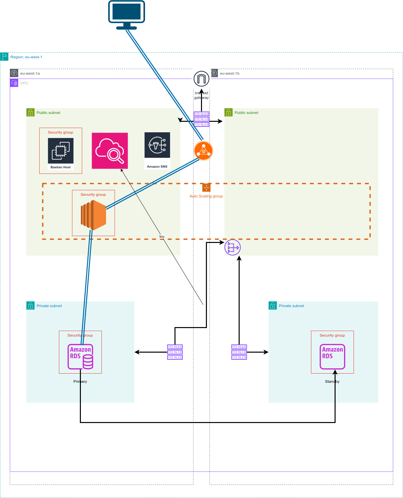

# Simple LAMP Stack Application Deployment on AWS

## Overview

This project demonstrates deploying a simple LAMP (Linux, Apache, MySQL, PHP) stack application on AWS using a scalable and highly available architecture. It follows AWS Well-Architected Framework best practices focusing on scalability, security, and availability.

## Application Features

- Welcome page with server information
- Database connection test
- User management system (create/view users)
- Session-based visit counter
- REST API endpoint for external applications
- Web interface for user management

## Architecture

- **Web Tier:** Apache running on multiple EC2 instances in an Auto Scaling Group
- **Load Balancing:** Application Load Balancer distributing traffic
- **Application Tier:** PHP scripts connecting to MySQL database
- **Database Tier:** Amazon RDS MySQL instance with Multi-AZ deployment
- **Monitoring:** CloudWatch for metrics and alarms
- **Notifications:** SNS for alerts and notifications



## AWS Components Used

### Compute and Networking

- **EC2 Instances:** Web and application servers running Ubuntu
- **Auto Scaling Group:** Automatically adjusts capacity based on demand
- **Application Load Balancer:** Distributes traffic across multiple instances
- **Security Groups:** Controls inbound and outbound traffic

### Database

- **Amazon RDS for MySQL:** Managed database service
- **Multi-AZ Deployment:** High availability with automatic failover

### Monitoring and Notifications

- **CloudWatch:** Monitors resources and applications
- **CloudWatch Alarms:** Triggers alerts based on metrics
- **SNS (Simple Notification Service):** Sends notifications when alarms are triggered

## Prerequisites

- AWS account with permissions to create EC2, RDS, ALB, and other resources
- SSH key pair to access EC2 instances
- Basic knowledge of AWS Management Console

## Deployment Steps

1. **Launch EC2 instance:**

   - Use Ubuntu Server 22.04 LTS AMI
   - Instance type: t2.micro (free tier)
   - Security Group:
     - Allow SSH (port 22) from your IP
     - Allow HTTP (port 80) from anywhere (0.0.0.0/0)

2. **Launch RDS MySQL instance:**

   - Choose MySQL engine
   - Enable Multi-AZ for high availability
   - Set database name, username, and password
   - Place RDS in the same VPC as EC2
   - Configure security group to allow MySQL (port 3306) from EC2 security group only

3. **Create an AMI from your configured EC2 instance**

   - Use this AMI for the Auto Scaling Group

4. **Set up Application Load Balancer:**

   - Create target group with health check path: /healthcheck.php
   - Configure listeners for HTTP (port 80)

5. **Create Auto Scaling Group:**

   - Use the AMI created from your configured instance
   - Set desired, minimum, and maximum capacity
   - Configure scaling policies based on CPU utilization

6. **Set up CloudWatch Alarms:**

   - Monitor CPU utilization
   - Monitor request count
   - Configure SNS notifications for alerts

7. **Connect to EC2 via SSH:**

   ```bash
   ssh -i /path/to/key.pem ubuntu@<EC2-public-IP>
   ```

8. **Install LAMP stack:**

   ```bash
   sudo apt update -y
   sudo apt install -y apache2 php libapache2-mod-php php-mysql mysql-client
   sudo systemctl start apache2
   sudo systemctl enable apache2
   ```

9. **Deploy the PHP application:**

   ```bash
   # Copy application files to web server directory
   sudo cp *.php /var/www/html/

   # Set proper permissions
   sudo chown -R www-data:www-data /var/www/html
   sudo chmod -R 755 /var/www/html
   ```

10. **Configure database connection:**
    - Update config.php with RDS endpoint and credentials

## Security Notes

- Do **not** expose RDS publicly; restrict access to EC2 security group only
- Use SSH key pairs for EC2 login; avoid password authentication
- Regularly update your instances and software for security patches
- Use IAM roles instead of hardcoded credentials

## Monitoring and Scaling

- **CloudWatch Metrics:** Monitor EC2 instances, RDS, and ALB
- **Auto Scaling:** Automatically adjusts capacity based on demand
- **Multi-AZ RDS:** Provides database high availability
- **Load Balancing:** Distributes traffic and provides fault tolerance

## Troubleshooting

- If page shows **HTTP 500 error**, check Apache error logs:

  ```bash
  sudo tail -n 20 /var/log/apache2/error.log
  ```

- Verify database connectivity using MySQL client from EC2:

  ```bash
  mysql -h <RDS-endpoint> -u admin -p
  ```

- Check Auto Scaling Group activity:
  ```bash
  aws autoscaling describe-scaling-activities --auto-scaling-group-name LAMP-Stack-ASG
  ```

## Application Endpoints

### API Endpoints

- **GET /api.php** - List all users in JSON format

### Web Interface Pages

- **/ or /index.php** - Home page with application overview
- **/create_user.php** - Form to add new users
- **/view_users.php** - Page to view all users in the database
- **/info.php** - PHP configuration information
- **/healthcheck.php** - Health check endpoint for load balancer

See api_documentation.md for detailed API and endpoint usage.
